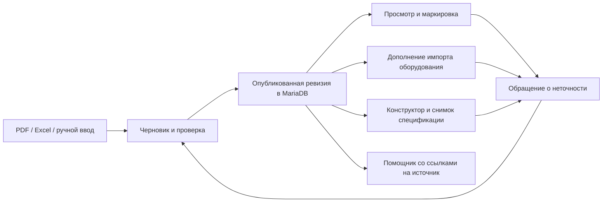

# Общий каталог оборудования и Конструктор: план переработки

Статус: реализованы Каталог и Конструктор, а также точечные связи Оборудования, Помощника и обращений. Основание — запрос владельца от 3 октября 2026, текущие исходники и два присланных PDF. Предложения объединения остальных программ остаются проектом. Этот документ сохраняет исходные требования; фактические возможности, проверки и ограничения описаны в [отчёте реализации](catalog-implementation-2026-10-03.md).

## 1. Назначение и границы

**Каталог** отвечает на вопрос «какие изделия выпускаем или используем, что означает их обозначение и какие у них подтверждённые характеристики». Это общий справочник компании, доступный без выбора проекта. Он хранит определения моделей, допустимые исполнения, характеристики, таблицы, документы и совместимость компонентов.

**Оборудование** хранит конкретное изделие в конкретном проекте: тег, положение, выбранную комплектацию, фактически загруженные данные и согласованные изменения. **Конструктор** помогает подобрать допустимую комплектацию и выпустить проектную спецификацию/бланк по Каталогу. **Теги** управляют проектными идентификаторами и связями. Эти сущности нельзя слить в одну запись: у них разные владельцы данных и жизненные циклы.

ВЕЗА — производитель основного изделия. Привод, двигатель или иной компонент внутри него может иметь другого производителя. Производитель компонента не заменяет производителя всего изделия. Одно изделие может участвовать в составе другого и одновременно продаваться отдельно; отдельного справочника «только комплектующие» с повторяющимися карточками не требуется.

У такого изделия один канонический ID и одна карточка модели. «Комплектующая часть» — роль модели в связи состава, а не её копия с другим набором характеристик. При миграции существующих Family/Component создаётся явное соответствие старых ID новой идентичности; ссылки старых проектов сохраняются.

В исходниках есть универсальные классы, семейства, параметры и правила. Реализация расширяет их с сохранением идентификаторов и связей. Первоначальные данные преимущественно клапанные; добавлен проверяемый пакет ОСА 300/301, снимки семейств в Оборудовании и поиск Помощника по опубликованному Каталогу.

## 2. Навигация Каталога

Главный экран: одна строка поиска; слева дерево видов оборудования, в центре модели, справа/в основной широкой области карточка выбранной модели. Основные виды заполняются по реальным данным: вентиляторы, клапаны, приводы, двигатели, установки, теплообменники, фильтры, решётки и другие. Пустые виды не создаются автоматически ради заполнения меню. Администратор может добавить вид и его признаки без изменения EXE.

Поиск принимает наименование, модель, маркировку и известный синоним. Изготовитель, назначение, исполнение и параметры — фильтры, а не дополнительные программы. Можно включить вид «таблица» для сравнения моделей; выбранные параметры и единицы сохраняются у пользователя. Избранное и недавно просмотренное — быстрые выборки в том же дереве.

| Текущая вкладка | Решение и причина |
|---|---|
| Модели оборудования | Основной Каталог: виды → семейства → исполнения. |
| Компоненты и модели | Включить в то же дерево видов; состав и применимость показать в карточке. Избавляет от двух мест для одного привода. |
| Excel | Кнопка «Импортировать данные» у редактора; формат Excel выбирается в мастере. Экспорт — действие над текущей выборкой. |
| Обмен | Объединить с импортом/экспортом. JSON — технический формат того же действия, не раздел сотрудника. |
| Правила тегов | Убрать из обычного просмотра Каталога. Сохранить данные и редактор в административных настройках сопоставления кодов; не смешивать тег проекта и код изделия. Перенос в интерфейс Тегов/Оборудования — отдельное изменение вне текущей переработки. |
| Пробный подбор | Поиск/расшифровка в карточке; проектный подбор — в Конструкторе. Отдельная вкладка дублирует два сценария. |
| Выученное | В инструментах редактора «Синонимы и распознавание». Необученные/пользовательские соответствия требуют проверки; они не становятся паспортными данными. |
| Проверка | Проверки перед публикацией и список замечаний редактора. Для просмотра сотрудником отдельный раздел не нужен. |

У обычного сотрудника нет восьми административных вкладок и форм JSON. У редактора в той же программе появляется «Управление»: черновики, импорт, проверка, обращения и история публикаций. Это рабочие инструменты, а не дополнительные пункты Пуска.

### Карточка модели

До пяти смысловых вкладок, без второй полосы вложенных вкладок:

1. **Обзор:** назначение, фото/схема, отличия вариантов, условия применения, состав и ссылки на совместимые компоненты.
2. **Характеристики:** сгруппированные параметры и размерные таблицы; фильтр исполнения, размера, двигателя/привода. Число всегда имеет единицу и условия применимости.
3. **Маркировка:** интерактивная строка обозначения и пояснения каждого сегмента.
4. **Документы:** оригинальный PDF, чертежи, монтажные/электрические схемы и графики с привязкой к странице.
5. **Сравнение:** только при выбранных нескольких моделях; иначе сравнение открывается действием и не занимает пустую вкладку.

Если типу не нужны графики, состав или отдельные схемы, пустые блоки не показываются. История и редактор правил доступны действием, не постоянно на виду. В карточке видны редакция данных, источник и статус проверки. «Не указано», «не применяется» и число 0 — разные значения.

## 3. Маркировка по образцу из PDF

**ОСА и клапаны — два примера для проверки универсальности, не единая схема всех изделий.** Схема обозначения принадлежит сочетанию «вид → изготовитель → семейство/модель → редакция». Общими остаются способ хранения сегментов и интерфейс объяснения; содержание, число/порядок сегментов, разделители, единицы, коды, необязательные части и ограничения задаются данными конкретной схемы. Две модели одного вида могут иметь разные схемы. Для изделий, у которых вместо разбираемой маркировки только артикул или свободное обозначение, допускается карточка без генератора сегментов.

Новый вид не наследует расшифровку клапана или ОСА по умолчанию. Наследование общих правил возможно только явно от выбранной проверенной схемы, с видимым переопределением для конкретной модели. После изменения схемы старые проекты продолжают ссылаться на прежнюю версию. В приёмке должны быть разные порядки/разделители и необязательные части, одинаковые коды с различным смыслом, а также модель без структурированной маркировки.

Строка отображается сегментами. Нажатие на сегмент показывает его значение, допустимые альтернативы, ограничение и страницу источника. Есть два связанных режима: «Разобрать обозначение» и «Собрать обозначение». Они используют одну схему, поэтому объяснение совпадает с генерируемым кодом. Изменение одного параметра пересчитывает допустимые варианты, а не молча заменяет соседние значения.

Пример из каталога ОСА, физическая PDF-страница **10**:

`ОСА 300 — 050/Б — 50 — Н — 00400/2 — У1 — 02`

| Сегмент | Отдельные данные |
|---|---|
| ОСА 300 | Семейство; алюминиевые лопатки. ОСА 301 — пластиковые. |
| 050/Б | Типоразмер и модификация колеса. |
| 50 | Индекс колеса, не типоразмер. |
| Н | Общепромышленное исполнение. |
| 00400/2 | Индекс мощности двигателя и число полюсов. В пояснении PDF этому примеру соответствует 4 кВт и 2 полюса. |
| У1 | Климатическое исполнение и категория размещения. |
| 02 | Тип корпуса; отличается от корпуса 01. |

Коды сохраняются строками: ведущие нули не теряются. Кириллическая «И» в списке модификаций колеса и «И» как условное обозначение индекса мощности не объединяются. Латинские и кириллические похожие буквы нормализуются только по явным синонимам конкретного семейства; исходный ввод сохраняется.

Матрица доступности ОСА на PDF-странице **6** и сноски на **10** ограничивают варианты: для ОСА 301 нельзя автоматически разрешить все исполнения ОСА 300. Аналогично, код «КВ» клапана и «ВК» вентилятора не получают универсальную расшифровку только по буквам. Если код неизвестен, показываем известную часть и «не распознано», а не выбираем ближайший по догадке.

Редакция клапанного каталога на PDF-странице **5** предупреждает об изменении маркировок с сохранением прежних для старых проектов. Поэтому схемы маркировки имеют версии и период применения; старое обозначение может быть корректным для старого проекта. Результат разбора показывает использованную редакцию.

Редактор маркировки: последовательность сегментов, разделитель, формат/ведущие нули, связь с параметрами, допустимые значения, обязательность и условия. Правила задаются декларативно, без выполнения JavaScript, SQL или произвольных формул из документа. Перед публикацией — эталонные обозначения и проверка «разобрать → собрать → совпало».

## 4. Что брать из двух PDF

Источники сохраняются отдельно: **ОСА 300/301, июнь 2024, 49 PDF-страниц** и **Воздушные клапаны, 04.06.2026, 116 PDF-страниц**. Более новая дата клапанного каталога не означает обновления вентиляторных данных.

### Вентиляторы

- ОСА 300/301 — связанные семейства с различиями материала и доступности исполнений; схема маркировки — PDF 10, номенклатурная матрица — PDF 6.
- Характеристики типоразмеров 040–125 — PDF 13–34. Строка связана с номером аэродинамической кривой, модификацией/индексом колеса, двигателем, габаритами и массой. Размер, полюсность и корпус образуют условия выбора строки.
- Обзорные графики — PDF 11–12, режимные — PDF 13–34. Полное, статическое и динамическое давление различаются. Условия воздуха, монтажа и получения кривой сохраняются; график не заменяется одной произвольной паспортной точкой.
- Комплектующие — PDF 35–48: например ВКО-ОСА, ЗОНТ-ОСА, ПЕТ-ОСА. Это отдельные изделия со своей маркировкой и связью применимости, а не дополнительные сегменты кода вентилятора.

### Клапаны

- Отсечные/регулирующие: РЕГУЛЯР, РЕГУЛЯР-Л, РЕГЛАН, КЕДР/КЕДР-С, варианты ГЕРМИК, НЕРПА, КЛАБ, ГЕК, ГАЗОХОД; обратные: КЛАРА/КЛАРА-КРОС, ТЮЛЬПАН, КОЛ, УКОЛ, НЕРПА-КО; отдельно КИД. Оглавление — PDF 3–4, сводная номенклатура — PDF 7.
- Различающиеся типы не схлопываются в одну таблицу свойств. Для КИД нужны настройка давления и монтаж; для ГЕК — герметичность и переходники; для ГАЗОХОД — особые среды/исполнения; для обратных — положение и направление потока.
- Таблицы живого сечения, типоразмеров, числа приводов и условий кассетирования — отдельные структурированные наборы. Пустая клетка не становится нулём или разрешённым промежуточным размером.
- Приводы и их параметры — приложение PDF **110** (печатная стр. 108); схемы подключения — PDF **111–115**. Выбор привода зависит от семейства, размера, момента, питания, управления и количества секций. Справочник НЕМАН и приведённые коды не означают взаимозаменяемость без правила совместимости.
- Графики, например КЕДР на PDF 27 и ГАЗОХОД на PDF 65, а также монтажные эскизы сохраняются как исходные изображения. Точные числовые точки появляются только после проверенной оцифровки.

Номер страницы хранится в двух полях: физическая страница PDF для открытия файла и напечатанный номер для человека. Каждое извлечённое значение связано с конкретной таблицей/фрагментом и редакцией. Этот этап изучения не означает, что все таблицы уже перенесены и проверены построчно.

## 5. Единая модель данных

| Объект | Содержание и связи |
|---|---|
| Вид оборудования | Дерево классификации, набор типовых параметров, фильтры; новые виды создаются данными. |
| Производитель | Изготовитель конкретного изделия; независим от изготовителей частей. |
| Семейство/модель | Назначение, материал, ограничения, изображения, версии; стабильный ID. |
| Исполнение/типоразмер | Явные значения и допустимые комбинации, не заранее созданное декартово произведение тысяч карточек. |
| Определение параметра | Стабильный ключ, название, тип, единица, варианты, допустимый диапазон и группа. |
| Значение/табличная строка | Значение, условия применимости, точность, источник, статус проверки. |
| Схема маркировки | Версионируемые сегменты, кодовые справочники, зависимости и эталонные строки. |
| Связь состава/совместимости | Основное изделие → компонент, количество, условия, допустимый вариант и производитель части. |
| Таблица/кривая | Оси, единицы, условные размеры/режимы, номер кривой, исходная страница; изображения и проверенные числовые точки различаются. |
| Документ/иллюстрация | Файл, хеш, редакция, страницы, подпись, связанная модель/таблица, область видимости. |
| Публикация/ревизия | Автор, проверяющий, дата, изменения и стабильная версия набора данных. |
| Обращение о данных | Объект, параметр, текущая ревизия/значение, предложение, доказательство, ответ и решение. |

Для параметров нужны число, диапазон, текст, перечисление, логическое значение и ссылка на компонент. Таблица допускает несколько входных осей: например H×B → живое сечение/число приводов, а не только «марка → набор колонок». Единицы имеют явное преобразование; значение 24/230 В не трактуется арифметическим делением. Отображаемый код и физическая величина сохраняются раздельно.

Модель не называет каждое изделие клапаном и не требует признаков клапана у вентилятора. Универсальные параметры дополняются схемой вида; пользователю показываются только применимые. Неоднозначные ограничения хранятся как примечание «по согласованию», не превращаются в жёсткий запрет по догадке.

## 6. Данные через MariaDB, публикации и импорт

Справочник, его права, ревизии и обращения находятся в общей MariaDB компании. Для новых моделей, параметров, таблиц, картинок и редакций PDF не требуется выпуск программы, пока используются поддержанные типы полей. Новый вычислительный алгоритм или новый тип редактора может потребовать обновления клиента — это отдельная граница.

Файлы источников доступны всем разрешённым клиентам через БД: общий механизм вложений/блоков с хешем и правами, а не путь `C:\Users\...` на компьютере администратора. В выбранном варианте без отдельной службы исходные файлы также хранятся блоками в MariaDB; локальная копия — только проверенный кэш. Выдача PDF/картинок и их фрагментов проверяет права на связанную модель/публикацию. Картинки, подписи и обрезки страниц привязаны к оригиналу. Размеры, квоты, разрешённые форматы и возобновление загрузки контролируются; исходники не включаются в portable или Git автоматически.

Статусы: **Черновик → На проверке → Опубликовано → Архив**. По умолчанию запись администратора можно проверить и опубликовать в одном потоке; обязательная проверка вторым человеком включается для критичных характеристик. Исправление опубликованных данных создаёт новую ревизию. Ошибка или закрытие импортера не оставляет половину записей видимыми сотрудникам.

Общая публикация имеет номер набора и ссылки на неизменяемые ревизии отдельных моделей, таблиц, правил маркировки и вложений. Проектный снимок фиксирует этот номер и выбранные ID/ревизии модели, варианта, строк таблицы и исходного документа. У смешанного поля отдельно сохраняется источник: значение из XML со своим файлом/полем, либо значение из конкретной каталожной ревизии, либо ручная правка с автором. Так обновление картинки не требует пересоздавать все значения, а изменение таблицы можно точно сопоставить с затронутыми проектами.

Мастер импорта общий для Excel/CSV/PDF и внутреннего пакета данных:

1. Выбрать файлы и вид/изготовителя. Автоматически предложить найденные модели и редакцию источника.
2. Для таблицы — выбрать лист, строку заголовков, сопоставить колонки и единицы; сохранить профиль повторного импорта. Для PDF — выбрать найденные разделы/таблицы, проверить объединённые заголовки и страницы. OCR и графики не объявляются точными без сверки.
3. Показать разницу: новые записи, изменённые значения, совпадения, конфликты и сомнительные ячейки. Дубликаты определяются по изготовителю/семейству/варианту и стабильному ID, а не только названию.
4. Сохранить проверенный черновик и опубликовать выбранный набор. Отсутствие строки в новом файле не удаляет старую модель без явного решения.

Безопасность импортера: ограничения размера и распаковки, поддержанные форматы, безопасный разбор XML/таблиц, отсутствие исполнения макросов и формул из файла, проверка содержимого/расширения, обработка вне UI-потока. Выражение из ячейки не становится кодом серверной проверки.

Версия опубликованного набора меняется атомарно в общей БД. В разных локальных API сокет одного клиента сам по себе не уведомляет всех сотрудников: необходима проверка общей версии, например каждые 15–30 секунд и при фокусе окна. Если версия совпала, повторно скачивать весь каталог не нужно. Списки загружаются постранично, большие таблицы виртуализируются, изображения кэшируются по хешу. Офлайн — просмотр последней известной версии с датой; публикация и выдача прав требуют связи с БД.

Ранее встроенное наполнение переносится как отдельная начальная ревизия. Обновление EXE больше не переписывает опубликованные характеристики через seed. Технические миграции схемы отделены от публикации предметных данных; пользовательские исправления сохраняются.

## 7. Права

| Действие | Сотрудник | Делегированный редактор | Администратор/владелец |
|---|---|---|---|
| Читать опубликованные разрешённые модели | Да | Да | Да |
| Расшифровать код, сравнить, открыть источник | Да | Да | Да |
| Сообщить о неточности | Да | Да | Да |
| Создать/изменить черновик | Нет | В своей области | Да |
| Импортировать набор данных | Нет | Если выдано право | Да |
| Опубликовать/архивировать | Нет | Если отдельно выдано | Да |
| Выдать право редактора | Нет | Нет | Да, в пределах полномочий |

Рекомендуемые отдельные разрешения: просмотр, редактирование, импорт, публикация, управление доступом. Выдача возможна по виду/изготовителю/набору данных; не только одна роль на весь Каталог. Проверки действуют в API и на вложениях, а не лишь скрывают кнопки. Истёкшая лицензия оставляет предусмотренное чтение и блокирует изменение данных.

Прямой общий SQL-доступ ограничивает защиту: пользователь с достаточными правами MariaDB может обойти интерфейсные роли. Правовая модель приложения не устраняет этот риск автоматически; см. [ручную проверку безопасности](manual-security-review-2026-10-03.md). Это важно и для публикаций Каталога.

## 8. Проект следующего этапа: дополнение данных Оборудования

При импорте сначала читаются реальные данные файла и определяется семейство/вариант. При точном совпадении недостающие поля дополняются опубликованной ревизией Каталога. При нескольких вариантах показываются различия; случайная «похожая марка» не назначается автоматически.

Одна понятная настройка по умолчанию: **«Заполнять отсутствующие значения из Каталога»**. Дополнительно: «только файл» и «для выбранных полей предпочитать Каталог». Существующие режимы и ручные значения мигрируют без изменения результатов проектов. Если XML и Каталог расходятся, показать оба значения, единицы и источник; ручное согласованное значение не стирается.

Каждое поле проекта имеет происхождение: файл/страница, каталог с ревизией либо ручная правка. Размерная таблица и выбор комплектации участвуют в поиске значения — одного совпадения модели недостаточно. Привод прикреплён к конкретному клапану/секции с количеством и совместимостью; его характеристики берутся из собственной карточки компонента.

Проект сохраняет снимок использованной ревизии. Новая публикация Каталога предлагает «Посмотреть изменения» и применить выбранные поля, а не меняет выпущенную спецификацию незаметно. Старую карточку можно открыть по её ревизии. Критичное исправление помечает затронутые проекты и требует явного согласования.

## 9. Конструктор оборудования

Его задача — проектный подбор, конфигурация и выпуск. Это не редактор мастер-каталога и не ещё одна универсальная электронная таблица. Название окна — «Конструктор оборудования»; пояснение в пустом состоянии — «Подбор и спецификация». В меню остаётся короткое «Конструктор».

Текущие пять вкладок сокращаются до рабочего процесса:

| Сейчас | Новый сценарий |
|---|---|
| Ведомость | Основной экран «Спецификация»: строки, количества, тег, выбранная модель, статус и источник. |
| Подбор | Карточка выбранной строки справа; доступные модели и условия в контексте этой позиции. |
| Импорт MTO | Действие «Загрузить ведомость» над спецификацией; предварительный просмотр и исправление сопоставления. |
| Бланки | Шаблоны в действии «Выпустить документы»; администратор шаблонов видит настройки, сотрудник — доступные варианты. |
| Выпуск | Подготовка/проверка/выпуск с историей предыдущих ревизий, без пустой постоянной вкладки. |

Прямой сценарий: загрузить ведомость → исправить только нераспознанные/конфликтные строки → проверить → выпустить. Ручной сценарий: добавить позицию → выбрать модель → заполнить необходимые параметры → добавить комплектацию → выпустить. Можно копировать позицию, массово применить одинаковое проверенное решение, отменить изменения и сохранять проектный черновик.

Клапаны, вентиляторы и другие виды используют одну спецификацию, но собственные поля и правила. Состав выводится вложенными строками с понятными количеством/производителем; один и тот же компонент в разных изделиях не теряет связь с владельцем позиции. Суммирование для закупки — отдельный вид представления, не уничтожение исходных строк/тегов.

Сотрудник может внести проектное значение, если имеет право на проект, но это не редактирует Каталог. «Предложить дополнение в Каталог» создаёт обращение/черновик на проверку. Запоминание выбора не обучает общий справочник автоматически. У выпущенного документа закреплены версии моделей, источников и шаблона.

## 10. Сообщения о неточности данных

Рядом с характеристикой, таблицей, сегментом маркировки и карточкой — действие **«Сообщить о неточности»**. В контекстном меню строки оно использует выбранное поле; в заголовке — всю карточку. На Оборудовании контекст включает проектную позицию и её источник. Не смешивать такую заявку с техническим падением программы.

Небольшая форма автоматически заполняет объект, поле, текущее значение/единицу, модель/вариант, проект при наличии и ревизию. Сотрудник пишет «что неверно»; предложенное значение и подтверждающая страница/фото необязательны. При явной опечатке достаточно одного короткого сообщения. Перед отправкой видны вложения и передаваемый контекст; лишние документы проекта и пароли не прикладываются.

Используется единый механизм «Замечания и предложения» с типами «Данные», «Работа программы», «Предложение», а не новая программа обращений. В управлении Каталогом есть отфильтрованная очередь своих данных. Техническая ошибка собирает диагностику; информационная — точное значение, источник и предложенную поправку.

Статусы: **Получено → Проверяется → Нужно уточнение → Исправлено / Отклонено / Дубликат**. Автор видит номер и ответ, редактор — сравнение текущей и предложенной версии. Решение «исправить» создаёт новую ревизию и проходит публикацию; обращение само данные не меняет. Если запись уже изменилась, показывается конфликт, а не перезапись свежих данных. Для отклонения — понятная причина; для исправления — ссылка на новую ревизию и уведомление автору.

При изменении исходной таблицы можно найти производные поля и проекты со снимком старой ревизии. Удаление/архивирование модели не стирает обращения или опубликованные документы. При снятии доступа заявитель сохраняет квитанцию и ответ, но не получает закрытые вложения. Одинаковые обращения объединяются с сохранением авторов.

## 11. Предложения для остальных программ — без реализации

Проверены 32 записи маршрутов, из которых три файловых обработчика/старых алиаса скрыты; это не 32 отдельные программы. Цель — уменьшить точки входа, сохранив различные предметные сущности.

| Программа/пересечение | Предложение и причина |
|---|---|
| Проводник, Файлы Windows, Общий доступ | Один вход «Проводник»; локальные/сетевые места и системная папка общего доступа внутри. Одинаковые операции с файлами не требуют трёх пунктов Пуска. |
| Таблица, Документ, PDF, Блокнот | Сохранить редакторы по типу файла, объединить в группу Flux Office и единый список недавних/шаблонов. Старые маршруты не создавать как отдельные приложения. |
| Выгрузка данных | Оставить самостоятельное рабочее окно, запускать из Оборудования/Конструктора; не вынуждать человека искать отдельную программу для экспорта. Общий движок таблицы использовать с Office, предметные настройки источника сохранить. |
| Теги и Оборудование | Сохранить разные объекты; общие переходы и карточка связи вместо повторного ввода тега. Не объединять только из-за наличия номера и характеристик. |
| Справочник проекта и Каталог | Развести названия: проектные коды/правила — «Настройки данных проекта», модели изделий — «Каталог». Общие единицы и классификаторы переиспользовать, проектные правила не делать глобальными. |
| Конструктор и Оборудование | Единая ссылка на проектную позицию и снимок Каталога. Конструктор — конфигурация/выпуск; Оборудование — состав и факты проекта. Дублирующие импортеры/экспорт могут использовать общие сервисы. |
| Менеджмент | Оставить закупки и поставки отдельно; брать утверждённые позиции спецификации без второго каталога изделий и повторного набора характеристик. |
| Помощник и Руководство | Общий поиск/вход помощи; руководство остаётся документированным источником, помощник объясняет и находит. Не удалять доступ к оригинальным инструкциям. |
| Переводчик | Быстрое действие в Office/Помощнике и расширенный отдельный редактор для больших переводов; один словарь, а не независимые дубли. |
| Замечания, Журнал, кнопка проблемы | Одна точка отправки и просмотра своих обращений; журнал остаётся инструментом диагностики администратора. Ошибка данных — отдельный тип заявки в общей системе. |
| Сотрудники и настройки ролей | Один раздел управления сотрудниками с профилями, импортом, ролями и доступами; настройки не дублируют формы пользователей. |
| Главная, Проекты, Настройки | Сохранить: обзор задач, выбор/управление проектами и параметры программы — разные задачи. Не добавлять ещё один общий «центр» со всеми теми же кнопками. |
| Почта и Мессенджер | Единый центр уведомлений и поиск, но разные источники сообщений/протоколы/права; полностью сливать переписку не рекомендую. |
| Календарь | Общие встречи/сроки проекта с переходами к источникам; не дублировать задачи и закупочные даты вручную. |
| Браузер | Вспомогательное окно/действие открытия ссылки; не переносить в него справочник оборудования или редактор документов. |
| Архиватор | Операции над файлами доступны из Проводника; отдельное окно оставить для сложной работы с архивом. Не путать ZIP/RAR с историей выпусков документов. |
| Flux Play | Отдельная необязательная группа, без смешивания с инженерными программами и правами редактирования данных. |

## 12. Проект следующего этапа: Помощник по данным оборудования

Помощник получает данные из того же опубликованного Каталога, с правами пользователя и ссылкой на модель/ревизию/страницу. Например: «что означает 050/Б в ОСА 300», «какое напряжение у этого привода», «какие исполнения доступны для ОСА 301». При необходимости просит типоразмер/редакцию, а не подставляет скрытые допущения.

По умолчанию отвечает по проверенным структурированным полям. Непроверенный текст PDF может быть показан как цитата с явной пометкой. Правила подбора выполняет общий детерминированный сервис, а не свободный текстовый ответ. Помощник не утверждает совместимость или значение с графика, если точных данных нет, и не исправляет Каталог по разговору. Текст документов не становится инструкциями модели или разрешением на действия.

## 13. Порядок реализации и приёмка

1. **Контракт данных и миграция:** стабильные ID, версии, параметры/единицы, документы, права, статус публикации; сохранить старые семьи, приводы, проекты и источники. Начальную загрузку двух PDF проводить в проверяемые черновики, без автоматической публикации всех OCR-данных.
2. **Каталог для просмотра:** одно дерево, поиск, карточка, таблицы, версия маркировки и документы. Проверить на вентиляторах и нескольких разных семействах клапанов, а не только на одной удачной карточке.
3. **Управление данными:** единый импорт, предварительная разница, проверки/публикация, выдача прав, обращения и история. Новые данные должны появляться у другого сотрудника через БД без обновления EXE.
4. **Конструктор:** проектная спецификация, карточка подбора в контексте строки, разные виды изделий, состав, проверки и выпуск со снимками.
5. **Следующий отдельный этап интеграции:** дополнение импорта Оборудования и поиск Помощника через подготовленный общий контракт; точечные обращения в контексте поля. Это отдельные функции, без перестройки экранов этих программ в текущем этапе Каталога/Конструктора. Остальные объединения остаются отдельными предложениями.

Минимальные сценарии приёмки:

- Сотрудник без проекта находит ОСА, расшифровывает пример и открывает PDF-страницу 10; неизвестный код не получает придуманной расшифровки.
- ОСА 301 не получает взрывозащищённую комплектацию только потому, что она есть у ОСА 300; версия старой маркировки не объявляется ошибочной без учёта проекта.
- Клапан и привод другого изготовителя связаны по совместимости/количеству; границы применимости таблицы не теряются.
- Новый вид оборудования создаётся как данные, не добавляет пустые клапанные поля и не требует новой программы.
- Обычный просмотрщик не изменяет каталог прямым API-запросом; делегат действует только в своей области; вложения закрытых данных недоступны.
- Повторный Excel-импорт не плодит модели; ведущие нули/единицы/пустые клетки сохраняются; ошибка одной строки видна до публикации.
- Администратор публикует ревизию, другой сотрудник видит её без обновления EXE; проектный снимок не меняется сам. При обрыве БД не публикуется половина набора.
- Неточность по конкретной ячейке доходит до очереди с источником и ревизией; решение исправить не стирает параллельную правку; автор получает ответ.
- Выпуск спецификации сохраняет модель, комплектацию, исходные значения и версию шаблона; повторный выпуск создаёт новую ревизию.
- Светлая/тёмная темы, окна 1024/1440, масштаб 125/150/200%, несколько мониторов: заголовки и маркировка не перекрываются, таблицы имеют собственный скролл, большие рисунки не сжимают форму. При малой ширине дерево сворачивается, чтение карточки сохраняется; код переносится по сегментам, а не вылезает за край.

Схема потока данных:

